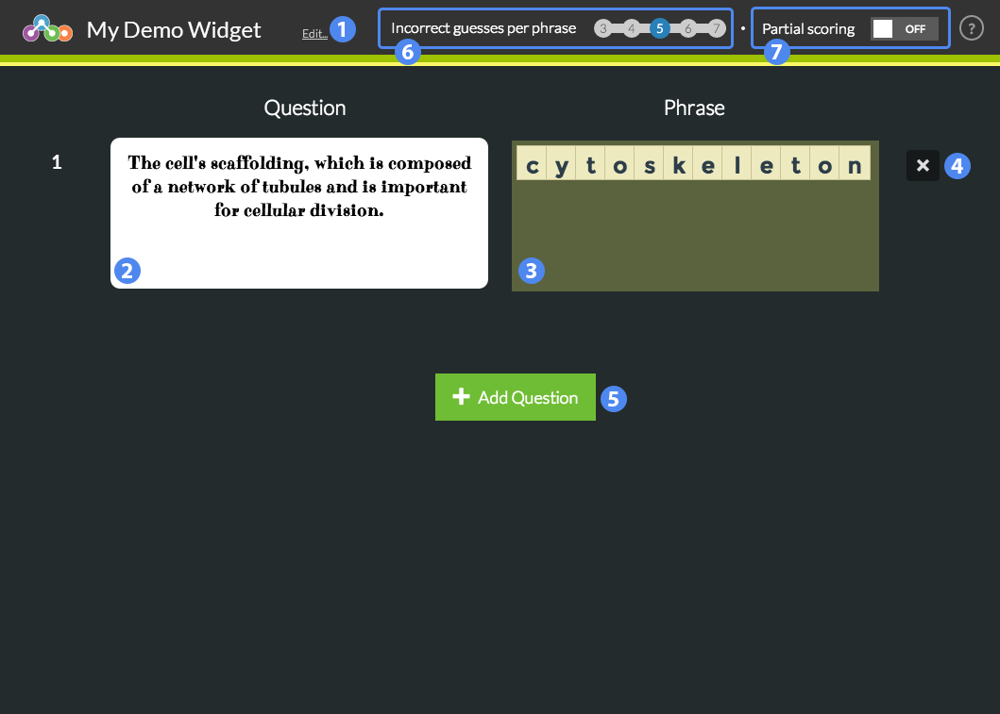

## Overview

Students are provided with a clue and must guess the word or phrase letter-by-letter. The question is marked incorrect after a certain number of wrong letter guesses.

1. Title of the widget
2. Question (clue) text
3. Word or phrase to be guessed
4. Delete or reorder question
5. Add a new question
6. Incorrect letter guesses allowed per question
7. Toggle randomize question order
8. Toggle partial scoring
9. Question bank options

## Details

Students guess the word or phrase by selecting individual letters. Letters that are a part of the word or phrase will be revealed once selected; incorrect letters will increment the incorrect guess count. After reaching the incorrect guess limit, the question is marked as wrong.

### Scoring

By default questions will be granted either full or no credit: if the word or phrase is completed without reaching the incorrect guess limit, the question is given full credit. If the guess limit is reached, the question is given no credit.

**Partial Scoring** will grant a certain percentage in credit for every correctly guessed letter, even if the incorrect guess limit is reached and the word or phrase is incomplete.

### Question Bank

When enabled, the player will select a subset of the total questions based on the value entered. These questions are chosen at random every time a new play is initialized. Note that when enabled, the question bank setting overrides the randomize order setting.