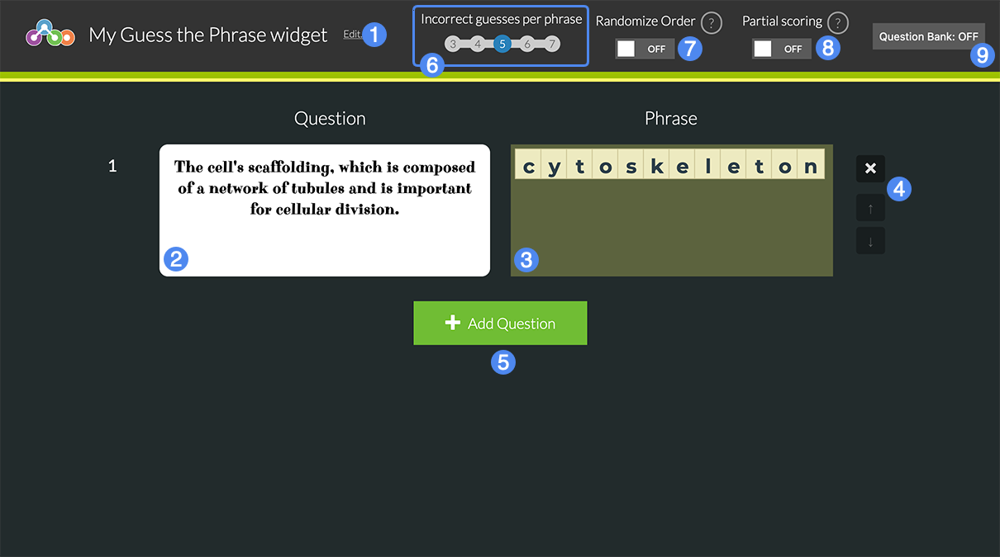

## Overview

Students are provided with a clue and must guess the word or phrase within a certain amount of letters.

1. Title of the widget
2. Word Row
3. Number of Guesses Before Failing Word
4. Toggle Credit for Partially Correct Words