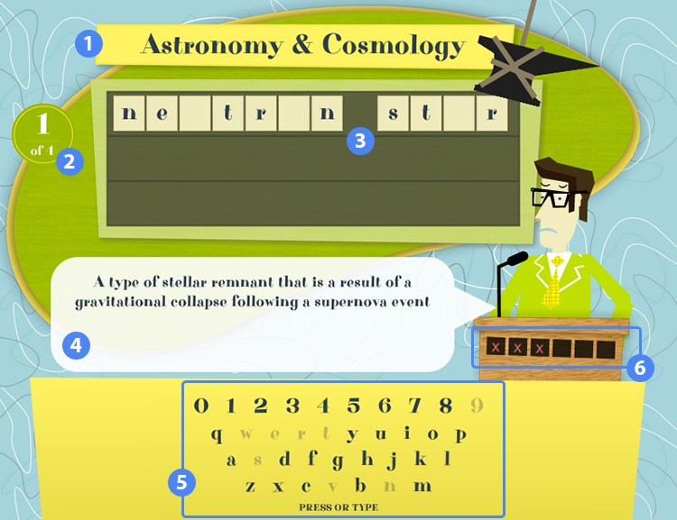

# Overview

Students are provided with a clue and must guess the word or phrase letter-by-letter. The question is marked incorrect after a certain number of wrong letter guesses.

1. Title of the widget
2. Question count indicator
3. Word/phrase board
4. Clue speech bubble
5. Keyboard letter input
6. Incorrect guess count

## Details

### Word/Phrase Board

As you guess letters correctly, tiles will fill in to eventually reveal the entire word or phrase.

### Keyboard

Click on the keys on this keyboard to submit a guess. You can also type on your keyboard and the letters/numbers on the virtual keyboard will lighten to indicate which have already been used.

### Submitting

When you've answered all of the questions you'll be presented with a button to submit your results and review your score.